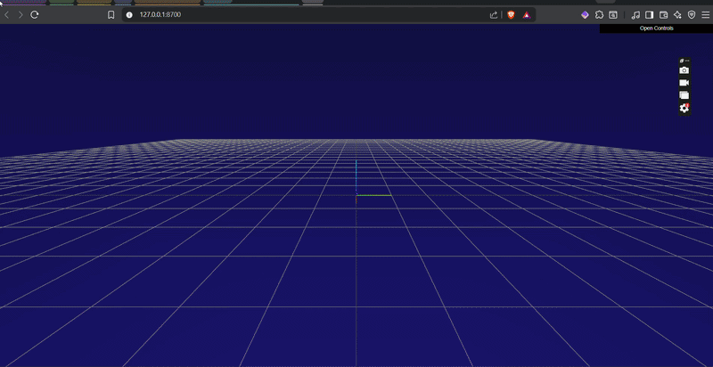

# 🚀 Swarm-SAR.jl: Autonomous Multi-Agent Search & Rescue Engine


**Swarm-SAR** is a high-performance, multi-threaded autonomous robotics simulation engine built in Julia. It bridges high-level active learning algorithms with low-level vector kinematics to route a swarm of drones through dynamic, actively hostile disaster environments.

Instead of relying on pre-programmed "lawnmower" grids, this engine uses a dynamic "Swarm Brain" to actively learn the environment, balance the reward of discovering casualties against the physical risk of degraded hardware, and execute multi-stage medical evacuations—all mapped over live SRTM satellite topography of the Western Ghats (Pune, India).



---

## ✨ Core Architecture & Features

This project moves beyond standard path planning, implementing true, degradation-aware autonomous systems architecture.

### 🧠 1. The "Brain": Active Learning & Cost Mapping
* **Gaussian Processes (GPs):** Utilizes `AbstractGPs.jl` to map spatial uncertainty across unknown terrain. 
* **Parallelized Cost Functions:** The global utility map is calculated using Julia's CPU multi-threading (`Threads.@threads`, `@simd`, `@inbounds`) to achieve C-level performance, allowing the swarm to process complex topography in milliseconds.

### 🚁 2. The "Physics": Vector Kinematics & APF
* **Artificial Potential Fields (APF):** Drones do not fly in static lines. The environment acts as a magnetic field. Casualties generate an Attractive Force ($\vec{F}_{att}$) , while hazards (floods, commercial airspace) generate Repulsive Forces ($\vec{F}_{haz}$).
* **Decentralized Swarm Communication:** Each drone calculates a local repulsive vector ($\vec{F}_{swarm}$) to actively push away from other drones in mid-air, preventing catastrophic collisions.

$$\vec{v}_{new} = \vec{v}_{old} + (\vec{F}_{target} + \vec{F}_{hazards} + \vec{F}_{swarm}) \times \Delta t$$

### ⚙️ 3. Multi-Stage Finite State Machines (FSM)
Every drone operates independently on a complex FSM, managing its own battery degradation and payload physics:
* `EXPLORING` $\rightarrow$ `DESCENDING` (Winching) $\rightarrow$ `RESCUING` (Payload Secured) $\rightarrow$ `ASCENDING` $\rightarrow$ `MEDICAL_EVAC` $\rightarrow$ `LANDING` $\rightarrow$ `CHARGING`
* **Bingo Fuel Protocol:** Drones constantly calculate topographical steepness and wind resistance to predict battery drain, automatically aborting missions to RTB (Return to Base) when reserves hit 25%.

---

## 🌩️ Dynamic Disaster Scenarios

The engine is completely modular. By adjusting the `ACTIVE_SCENARIO` in `Scenarios/config.jl`, you can inject hostile weather physics into the FSM:

* **🌊 `CYCLONE_FLOOD`**: Flash floods drown the lower valleys. Drones utilize a virtual 3-meter LiDAR scan to detect the mathematical "wall" of the water, forcing the APF vectors to organically "hug the coast" to find dry land bridges. Vision radius is severely reduced by rain.
* **🌋 `EARTHQUAKE`**: The primary Base Station coordinates become compromised. If a returning drone scans a destroyed LZ, it broadcasts a swarm-wide `[MAYDAY]`, triggering all drones to instantly recalculate their APF vectors and reroute to a secondary mountain Base Station.

---

## 💻 Installation & Usage

### Prerequisites
* **Julia 1.9+**
* A local clone of this repository.

### Setup
1. Open your Julia REPL in the project directory and install the required dependencies:
```julia
using Pkg
Pkg.add(["Rasters", "RasterDataSources", "ArchGDAL", "MeshCat", "GeometryBasics", "Colors", "CoordinateTransformations", "FileIO", "MeshIO", "AbstractGPs", "KernelFunctions"])
```

Running the Engine
Critical: Because this engine relies on heavy parallelization to calculate the Artificial Potential Fields, you must launch Julia with the auto-threading flag.

```julia
# Launch with all available CPU cores
julia -t auto geo_mapping.jl
```

Watch the terminal for the [INFO] MeshCat server started URL (usually http://127.0.0.1:8700).
Open the URL in your browser to view the live 3D digital twin.
Monitor the terminal for the real-time S.A.R. Telemetry Stream and FSM state changes.

🛠️ Future Scope / Phase 3
ROS 2 Integration: Implementing a Python rclpy bridge to export the dynamic [X, Y, Z] waypoints to a physical drone's Nav2 C++ control stack via local CSV streaming.
Hardware Degradation MCMC: Fusing a Turing.jl Hierarchical Bayesian Model to track long-term motor wear-and-tear across multiple deployment cycles.
